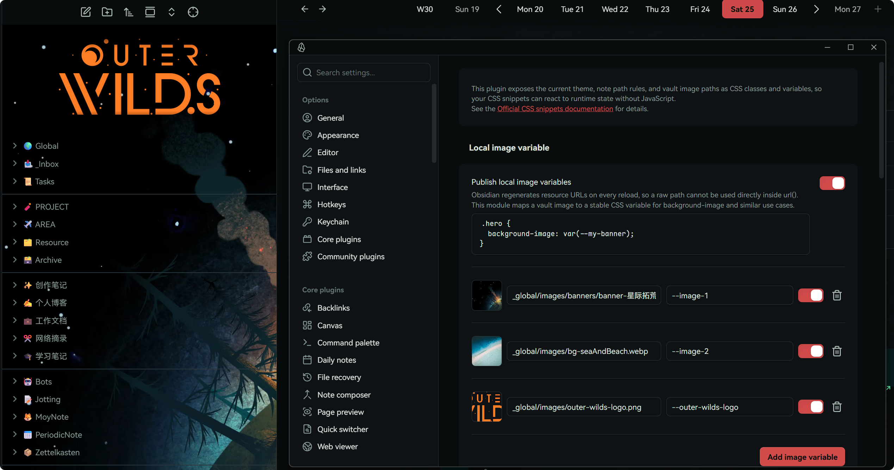
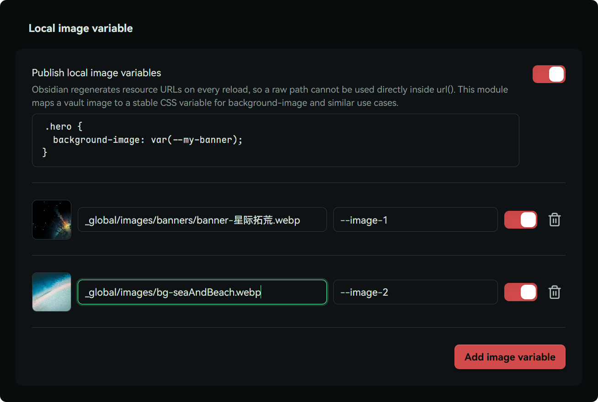
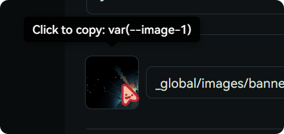
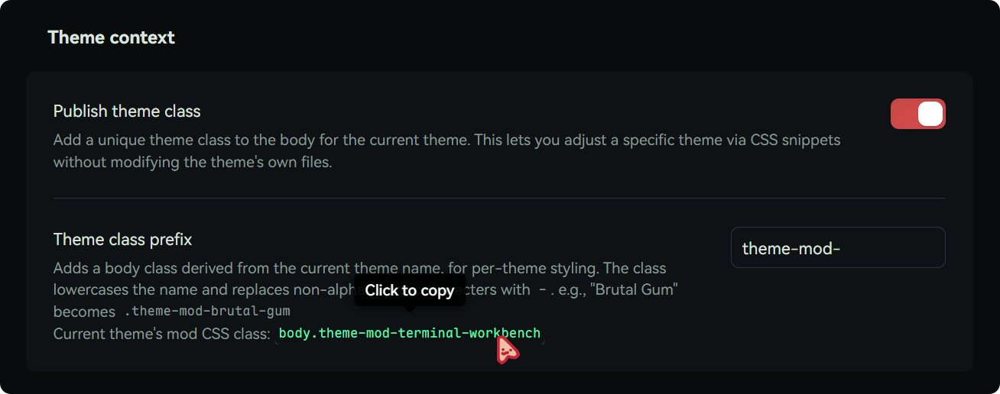
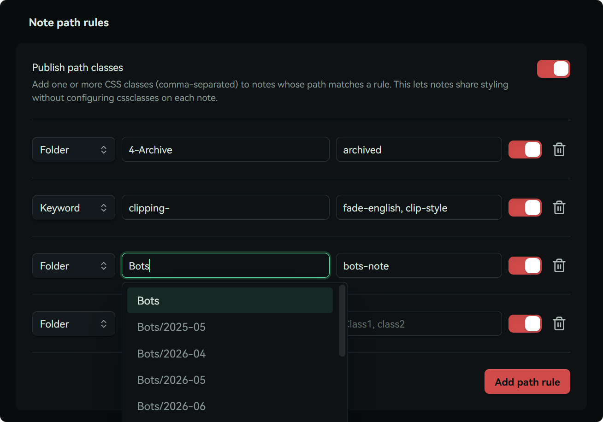

# Style Context - Obsidian CSS variable helper

English | [中文文档](#样式上下文)

    

An Obsidian plugin that publishes runtime context as CSS classes and variables. It turns things like your current theme and vault image paths into predictable hooks for your own custom CSS snippets, and can optionally apply a vault image variable as a canvas background.

  

> The theme and note-path modules only publish context/state. The optional background image module is a built-in convenience layer; all of its visual options remain configurable in the plugin settings.

## What problems does it solve?

Two practical use cases:

1. Map vault images to stable CSS variables, so you can use local images in `background-image` and related properties.

> [!note]  
> **Why this matters**:  
> in Obsidian, vault resource URLs are regenerated and can change across reloads, which makes direct `url()` usage unreliable. This plugin gives you stable variable references instead.

2. Add CSS that only applies to a specific theme, so you can patch/tune theme details without editing the theme's original CSS.

> [!note]  
> **Why this matters**:  
> many themes look great overall, but still have details you may want to tweak. If the theme does not expose Style Settings options, targeted CSS overrides are often the safest approach. Editing theme files directly is fragile because updates can overwrite your changes.

## How it works

## Local image variable

Obsidian regenerates resource URLs on vault reload, so raw paths are not stable inside `url()`. This module maps a vault image to a stable CSS variable that you can reference from `background-image` and similar properties.



Pick an image in settings, assign a CSS variable name, and then use `var(--name)` directly in your CSS.

Click the preview image on the left to quickly copy the variable reference:  


>   
> No more uploading images to the web or pasting long base64 strings just to style a background.

💡 [here](snippets/Moy-Image-Background.css) is a sample snippet that uses the image variable to set image background and top logo for file explorer.

### Built-in background image

The **Background image** settings group accepts a complete CSS image value. Paste a local variable reference such as `var(--image-1)`, use a web image such as `url("https://example.com/image.jpg")`, or click the shuffle button to choose one of your enabled local image variables at random. Remote URLs contact the image host and may disclose normal network request information.


The image layer has its own opacity and blend mode, so it does not make notes or controls translucent. Size, position, repeat, and attachment are also available in the Appearance sub-page, grouped with CSS filter adjustments (brightness, blur, and more) so related tweaks sit side by side. Disable the toggle to remove the injected layer and restore the theme's original canvas styles.

### Theme context

If a theme supports Style Settings, great, use that first.
If it does not, this module gives you a reliable fallback.

When enabled, the plugin adds a theme-specific class to the top-level Obsidian DOM. For example, with the Brutal Gum theme, you get `theme-mod-brutal-gum`.

Then you can write scoped overrides like:

```css
.theme-mod-brutal-gum .markdown-preview-view {
  /* theme-specific overrides */
  --my-background-color: #66ccff;
  background-color: var(--my-background-color);
}
```

No setup required for the core behavior, just enable the plugin.
You can click to copy the current theme class in settings:


> There is also a command to copy the current theme class, handy when writing CSS snippets.

### Batch note CSS classes

This is a bonus feature.
If you frequently use the note `cssclasses` property, this can save time.

You can configure folder path prefixes (or keywords), and matched notes are automatically assigned your chosen CSS class name.
That lets you apply styles to whole groups of notes without manually adding `cssclasses` in each note.



## Vibe coding level

People often ask, so here is the direct answer:
the vibe coding level of this plugin is around `80%`.

The plugin itself is actually very small, and started from a personal CST script. The real feature code is lightweight; most of the plugin size comes from settings UI and surrounding structure.

The goal is simple: solve my own daily workflow first, then share it for others who might need the same thing.

Because I use this plugin heavily every day, I am also the first person affected by any issue, which is why I keep maintaining it.

## Build

Small convenience trick: if you place a `.env` file in the plugin folder (or its parent) with:

```env
VAULT_PATH=C:/path/to/your/ObsidianVault
```

you can run `npm run build:local` to build and auto-copy into your vault.

## Release

After writing complete notes under `## [Unreleased]`, run `npm run release -- 0.3.0`. The command requires a clean, synchronized default branch; it synchronizes all version metadata, promotes the changelog entry, runs checks, commits, creates and atomically pushes the tag, then waits for GitHub Actions to verify the published Release and its three plugin assets. Use `npm run release:dry-run -- 0.3.0` to validate without changing anything.

If a version was already committed and annotated locally, but has not reached GitHub, use `npm run release:resume -- 0.3.0`. It validates the local tag's immutable metadata and changelog, runs the full check, fast-forwards the default branch and tag atomically, then performs the same CI and asset verification. Use `npm run release:resume:dry-run -- 0.3.0` to check this recovery path without changes. This is recovery only; ordinary releases must use `release`.

## Support

Nah, this is a small utility. No sponsorship needed, enjoy it <3

If you like my plugin design, you can check my other plugins here:

[Moy's plugins - Obsidian Community](https://community.obsidian.md/users/moyf)


# 样式上下文

一个面向 Obsidian 的 CSS 变量辅助插件。它会把 Obsidian 的特定上下文（当前主题、库内图片路径）转换为 CSS 类名与变量，也可以把图片变量直接应用为画布背景。

> 主题和笔记路径模块只负责发布状态；可选的背景图片模块提供了内置的便捷样式层，所有视觉选项都可以在插件设置中调整。

## 它解决什么问题？
举个例子，两大最实用的功能：
1. 将仓库内的图像映射为稳定的 CSS 变量，便于在 `background-image` 等属性中引用。

> [!note]
> **为什么有这种需求？**  
> obsidian 的 CSS 中如果想使用图片素材，只能用 `url()` 来引用网络链接，因为仓库内的图像 URL 每次都会变化。有了这个插件，你就可以直接用仓库内的图片设置背景图了。

2. 针对某个特定主题添加样式，用来修正/调整那些主题本身没提供的样式，同时不用修改主题本身的 CSS 文件。

> [!note]
> **为什么有这种需求？**  
> 很多主题可能本身很好看，但又有一些你想自己调节的地方。如果主题没提供 StyleSettings 设置，就只能自己写 CSS 覆盖，这时候，「只在特定主题生效的 CSS」就很关键。
> 为什么不直接改主题？因为主题本身一旦更新，你做的改动就会丢失，所以补丁式的 CSS 才是最稳妥的做法。

## 如何作用？

## 本地图像变量
Obsidian 每次重载仓库时都会重新生成资源 URL，因此原始路径无法直接稳定地用于 `url()`。此模块会把仓库内图像映射为稳定的 CSS 变量，便于在 `background-image` 等属性中引用。


只需要在设置中选择图片文件，分配给它的 CSS 变量名——Viola！你就可以在 CSS 中直接使用 `var(--name)` 来引用它了。  

点击左侧的预览图片可以快速复制该图片变量：  


>   
> 再也不用想着先把图片传到往上，或者插入冗长的 base64 编码了  

💡 [点我查看](snippets/Moy-Image-Background.css) 示例 CSS 样式代码片段，用于给文件资源管理器设置背景图和顶部 LOGO。

### 内置背景图片

设置中的「背景图片」接受完整的 CSS 图片值。可以直接粘贴 `var(--image-1)` 这样的本地变量引用，也可以填写 `url("https://example.com/image.jpg")` 使用网页图片，或点击输入框旁的随机按钮选择已启用的本地图片变量。远程 URL 会连接图片所在网站，并可能暴露常规网络请求信息。

背景图层拥有独立的不透明度和混合模式，不会让笔记或控件一起变透明；「外观」子页面集中提供尺寸、位置、重复方式和附着方式等常用选项，以及 CSS 滤镜（亮度、模糊等）调整，方便联动调节。关闭开关即可移除内置图层，恢复主题原本的画布样式。

### 主题上下文

如果主题提供了StyleSettings设置，那么当然优先使用 StyleSettings。
但是如果主题没有提供——这就需要自己动手了。

我这两年尝试了百来个主题，其中很多都非常喜欢，但又想要自己微调一下。
所以，我写了个脚本（也是这个插件的前身），可以在 Obsidian DOM 的顶部层级加上当前主题对应的类名。

例如，使用 Brutal Gum 主题时，DOM 顶层会加上 `theme-mod-brutal-gum` 类名。

然后我们就可以用这样的代码去覆盖主题的样式：

```css
.theme-mod-brutal-gum .markdown-preview-view {
  /* 主题专属覆盖样式 */
  --my-background-color: #66ccff;
  background-color: var(--my-background-color);
}
```

这个不需要设置，启用即可自动生效。  

你可以点击并复制当前主题的类名：


> 此外，插件也提供了 Command 来复制当前主题的类名，方便你在 CSS 片段中使用。

### 笔记批量分配 CSS 类名

这算个 Bonus 功能——
如果你经常使用笔记的 `cssclasses` 属性，它或许会有用。

你可以在设置中填写文件夹路径（或者关键字），匹配的笔记会被自动分配你填写的 CSS 类名。
这样你就可以批量对某类笔记应用特定的 CSS 样式，而不需要在每篇笔记中都手动添加 `cssclasses` 属性了。


## Vibe Coding 含量
我知道很多人会关心这个，所以直接了当地说：  
该插件的 Vibe 浓度大约为 `80%`。

这个插件的体量其实**相当小**，它来自我之前自己手写的 CST 脚本文件。
因为只是注册几个插件变量的事儿，当时几十行代码就能完事儿。  
转成插件之后，我觉得反而是设置部分的代码占了大多数……实际的功能其实就那么点儿，你可以自行检查。

我 Vibe 出来的需求首先是满足我自己的需求，然后才是分享给可能有类似需求的其他用户使用，希望对你有所帮助。

请放心，这个插件是我自己的每日高需求使用插件，因此我是第一责任人，也有着持续维护的必要。

## 构建
我的插件有一个小技巧：只要你在插件文件夹（或者上层文件夹）放一个 `.env` 文件，里面写上：
```
VAULT_PATH=C:/path/to/your/ObsidianVault
```

那么你就可以直接使用 `npm run build:local` 来构建并自动拷贝到你的仓库内 `;)`

## 发布

在 `## [Unreleased]` 下写完完整更新说明后，运行 `npm run release -- 0.3.0`。该命令要求默认分支干净且已和远端同步；它会同步所有版本元数据、将 Changelog 条目提升为正式版本、执行检查、提交、创建并原子推送 tag，最后等待 GitHub Actions 验证正式 Release 与三个插件资产。使用 `npm run release:dry-run -- 0.3.0` 可只做校验，不修改任何内容。

若版本已在本地提交并创建注释 tag，但尚未到达 GitHub，使用 `npm run release:resume -- 0.3.0`。它会校验本地 tag 中不可变的版本元数据与更新日志、执行完整检查，再原子插入默认分支并推送 tag，之后执行同样的 CI 和资产验证。可用 `npm run release:resume:dry-run -- 0.3.0` 不改动任何内容地校验此恢复路径。这只用于恢复中断的发布；正常发应始终使用 `release`。

## 赞助
Nah，我不觉得这种小工具有什么值得赞助的，用得愉快！ <3

如果你认可我的插件设计，可以查看我的其他插件：

[Moy's plugins - Obsidian Community](https://community.obsidian.md/users/moyf)
